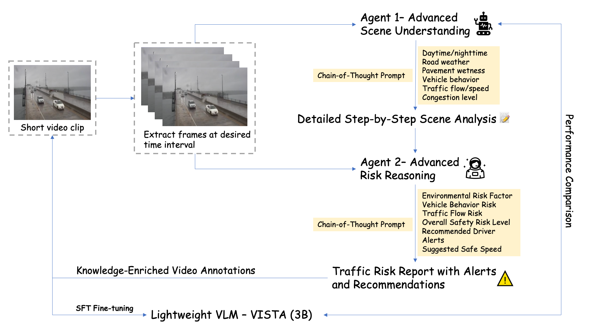
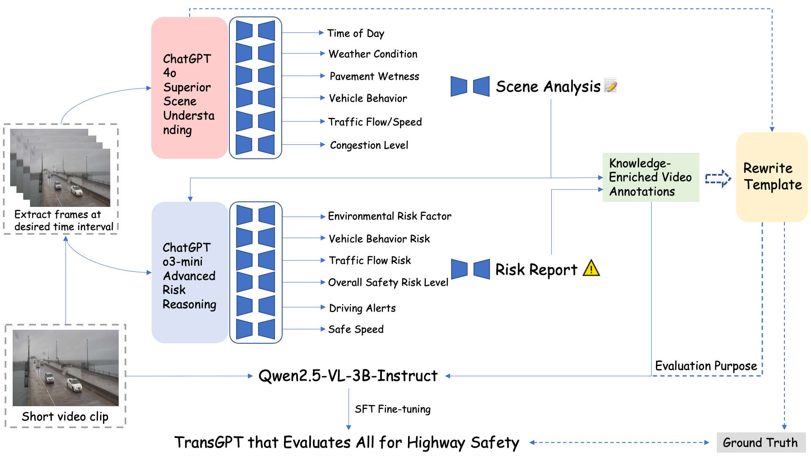

# Vista (3B)-Vision-informed-Safety-and-Transportation-Assessment


<br>
<span>
<b>Authors:</b> 
<a class="name" target="_blank" href="https://winstonyang117.github.io/">Yunxiang Yang<sup>*</sup></a>, 
<a class="name" target="_blank" href="https://zhigao2017.github.io/">Ningning Xu<sup>*</sup></a>, 
<a class="name" target="_blank" href="https://engineering.uga.edu/team_member/jidong-yang/">Jidong Yang<sup>†</sup></a>, 
<br>
<sup>*</sup>Equal Contribution. 
<sup>†</sup>Corresponding Author.
</span>


# 🔥News
- [2025/07/29] We released our paper — discussions and feedback are warmly welcome!
- [2025/07/29] We released our SFT dataset, model, training, and evaluation code. Welcome to download and explore them.

<br>


<details><summary>Abstract</summary> 
Accurate road scene understanding and robust traffic risk analysis are critical for the advancement of Intelligent Transportation Systems (ITS) and autonomous driving. Traditional methods often struggle with scalability and generalization, particularly under the diverse and unpredictable conditions of real-world traffic environments. We introduce a novel multi-agent prompting and distillation framework to address these limitations, enabling the automatic generation of high-quality traffic scene annotations and contextual risk assessments.

Our framework orchestrates two large Vision-Language Models (VLMs), ChatGPT-4o and o3-mini, using a structured Chain-of-Thought (CoT) strategy to produce rich, multi-perspective outputs. These outputs serve as knowledge-enriched pseudo-annotations for supervised fine-tuning of a much smaller student VLM. The resulting compact 3B-scale model, named VISTA, is capable of understanding low-resolution traffic videos and generating semantically faithful, risk-aware captions.

Despite its significantly reduced parameter count, VISTA achieves strong performance across established captioning metrics (BLEU-4, METEOR, ROUGE-L, and CIDEr) when benchmarked against its teacher models. This demonstrates that effective knowledge distillation and structured multi-agent supervision can empower lightweight VLMs to capture complex reasoning capabilities. The compact architecture of VISTA facilitates efficient deployment on edge devices, enabling real-time risk monitoring without requiring extensive infrastructure upgrades. We release the full training pipeline and model checkpoints to foster scalable and adaptable solutions for region-specific transportation safety applications.
</details>

## Framework


## Training and testing pipeline


<br>

# Training

## SFT Stage

### Installation

Please follow the [Qwen2.5-VL](https://github.com/QwenLM/Qwen2.5-VL) repository to install the environment.

### Data Preparation

1. You can access the dataset by the official site of [511 Virginia](https://511.vdot.virginia.gov/), [511 GA](https://511ga.org/cctv?start=0&length=10&order%5Bi%5D=1&order%5Bdir%5D=asc), and [Caltrans](https://cwwp2.dot.ca.gov/vm/iframemap.htm).

2. After processing the dataset, you can use the scripts in `data_process` to generate the training and testing json file for fine tuning QwenVL-2.5 model. 

### Launch Training

Training can be started with the following script.

```bash
conda activate Qwen
bash ./scripts/sft_3b.sh
```

<br>

# Evaluation
Use this command to install the required package for evaluation 
```bash
pip install -r requirements.txt
pip install pycocoevalcap
```

### Inference

```bash
conda activate Qwen
python evaluation_calculation_weather.py
```


